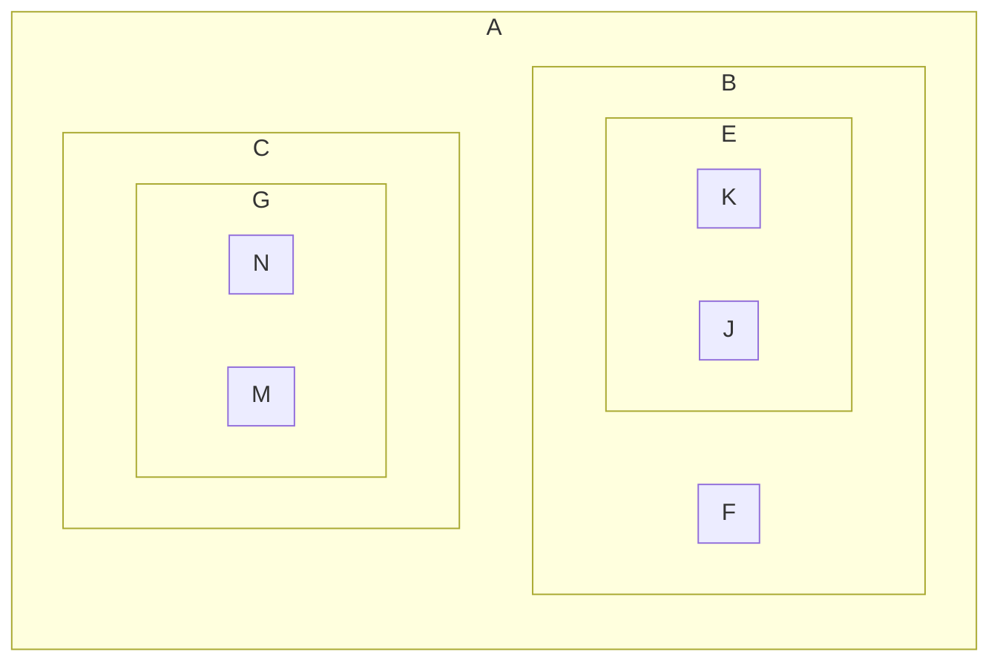

# Chapitre 13 : Les arbres

> [!info] Index
> [[Index|Retour à l'index]]

## I - Notion d'arbre

### A - Introduction

> [!tldr] Mise en situation
Considérons un ensemble fini $A$ de points disposés de cette manière : 
>
>![[Web/src/Capture d'écran_20230221_085540.png]]
>
On peut définir une relation d'odre $\prec$ :
>- $a$ est le plus petit élément de l'ensemble $A$.
>	$a \prec b \prec e \prec j, h$ 
>	$a \prec b \prec f$
>	$a \prec c \prec g \prec m, n$ 
>- $j, k, f, m, n, h$ des éléments maximaux de $A$ .
>- $x \prec y$ s'il existe un chemin d'origine $x$ et de destination $y$.

### B - Première définition

> [!note] Définition
Soit un ensemble $(A, \prec)$, tel que $A$ est **arborescent** :
>- $A$ admet un élément minimal $\rightarrow$ **la racine** 
>- lorsqu'on supprime la racine on obtient une réunion d'arbres qu'on appelle une **forêt**.

### C - Représentations

#### 1) Avec des ensembles



#### 2) Indentation

a
	b
		e
			j
		f
	c
	...

#### 3) Linéaires parenthésées

> [!example] Notation préfixée
Racine puis les sous-arbres :
(a (b (e (j) (k)) (f)) ...)

> [!example] Notation postfixée
Sous-abres puis racine :
(... ( ( (j) (k) e) b) a)

### D - Arborescences

> [!note] Définitions
Soit $(A, \prec)$ un ensemble ordonné où $\prec$ est l'ordre strict associé à $\preceq$.
On dit que $A$ est **arborescent** si on a :
>- $A$ est un ensemble fini
>- $A$ admet un plus petit élément
>- Pour tout $a \in A$ l'ensemble des prédécesseurs de $a$ est *totalement ordonné*.

> [!note] Définition
Les éléments maximaux de $A$ sont appelés les **feuilles**. 

> [!note] Définitions
Soit $a \in A$
>- Si $a$ n'est pas la racine de l'ensemble de $A$, on appelle **père** de $a$ le *prédécesseur immédiat* de $a$.
>- Si $a$ n'est pas une feuille de $A$, on appelle **fils** de $a$ les *successeurs immédiats* de $a$.

> [!tip] Proposition
Soit $A, \prec$ un ensemble arborescent et $a \in A$ 
>- Si $a$ n'est pas une feuille de $A$ alors il est le père de ses fils. 
>- Si $a$ n'est pas la racine alors il est le fils de son père.

> [!tldr] Preuve
Supposons que $a$ n'est pas une feuille de $A$ et soit $b$ un fils de $a$.
Alors $b$ est un successeur immédiat de $a$ donc en particulier il n'existe pas de $x$ tel que $a \prec x \prec b$ et donc $a$ est un prédécesseur immédiat de $b$. 

### E - Forêts

> [!note] Définition
Soit $(F, \prec)$ un ensemble ordonné
$F$ est une **forêt** si on a : 
>- $F$ est fini
>- Pour tout $a \in F$, l'ensemble des prédécesseurs de $a$ est *totalement ordonné*

> [!tip] Théorème
Toute forêt est la réunion d'un nombre fini d'ensembles d'arborescence deux à deux disjoints.

### F - Terminologie des arbres

> [!note] Définitions
**Racine** : nœud sans prédéceseur.
**Feuille** : nœud sans successeur.
**Nœuds internes** : nœuds avec successeur.
**Fils** : les successeurs d'un nœud.
**Père** : le prédécesseur d'un nœud.
**Arrête** (branche) : le lien entre le fils et le père.
**Hauteur** : plus grande distance depuis la racine (arbre à un seul élément : hauteur = 0).
**Profondeur** (d'un nœud) : distance du nœud à la racine (on compte le nombre d'arrête).
**Degré (arité) d'un nœud** : nombre de branches qui partent d'un nœud.
**Degré d'un arbre** : n si tout les nœuds internes sont d'arité n.
**Taille** : nombre de nœuds.
>
On appelle **arbre étiqueté** tout quadruplet $(A, \prec, \varepsilon_{N}, \varepsilon_{F})$ d'un arbre $(A,\prec)$, d'une application $\varepsilon_N$ de l'ensemble des nœuds dans $N$ et de l'application $\varepsilon_F$ de l'ensemble des nœuds de $F$. 

### G - Implémentation en OCaml

#### 1) Première définition

```OCaml
type 'a arbre = 'a * 'a arbre list
```

```OCaml
type 'a arbre = 
	| Feuille of 'a
	| Noeud of ('a * 'a arbre list)
```

#### 2) Deuxième définition

```OCaml
type ('f, 'n) arbre =
	| Feuille of 'f | Noeud of 'n * ('f, 'n) foret
and ('f, 'n) foret = Arbres of ('f, 'n) arbre list
```

> [!example] Exemple
>```mermaid
flowchart TD
E((3)) --- A(('a'))
E --- B(('b'))
E --- F((3))
F --- C(('c'))
F --- D(('d'))
>```
>```OCaml
let a = Noeud (3, Arbres ([Feuille 'a'; Feuille 'b'; Noeud (3, Arbres ([Feuille 'c'; Feuille 'd']))]);;
>
let f = Arbres ([a;a])
>```

### H - Implémentation C

```C
typedef struct noeud {
	int element;
	struct noeud * fils;
	struct noeud * frere;
} arbre;
```

## II - Objets inductifs

### A - Définition informelle

> [!note] Définition inductive d'un objet
>- un (ou plusieurs) objets de base
>- une (ou plusieurs) règles de combinaison des objets

### B - Exemples

> [!example] Les listes OCaml
$\begin{cases} \text{une liste vide, notée [] -> cas de base} \\ \text{une règle : si e est un élément et l une liste, alors e::l est une liste qui contient l'élément e et dont la queue est l} \end{cases}$

> [!example] Les entiers de Peano
$\begin{cases} \text{le nombre appelé Zéro (0) est un entier naturel} \\ \text{si n est un entier naturel, alors Succ(n) est un entier naturel} \end{cases}$
>```ocaml
type nat =
>	| Zero
>	| Succ of nat
>
>let rec addition n m = match n with
>	| Zero -> m
>	| Succ p -> addition p (Succ m)
>
>let rec double n = match n with
>	| Zero -> Zero
>	| Succ p -> Succ (Succ (double p))
>```

### C - Principe d'induction 

> [!note] Principe
Soit $X \subseteq E$ définie inductivement par $(B,R)$. Soit $P$ un prédicat sur $E$.
>1) Si $P(x)$ est vrai pour tout $x \in B$.
>2) Si pout tout $r \in R$, pour tous $x_{1},...,x_{n} \in X$. Si lorsque $P(x_1),...,P(x_n)$ sont vrais alors $P(r(x_{1},...,x_n))$ est vrai de $1$ et $2$. $P(x)$ est vrai.

> [!example] Exemple
Tout arbre à $n$ sommets possède $n-1$ arrêtes.
>
<u>Initialisation</u> : Si l'arbre est réduit à 1 feuille, alors 0 arrêtes, la propriété est vérifiée.
<u>Conservation</u> : Soit $A$ un arbre de racine $a_0$ et de sous-arbres $A_{1},...,A_{p}$ avec $n$ sommets, chaque branche issue de $a_0$ ayant $n_{1},...,n_p$ sommets.
Le nombre de sommets $n$ est donné par $n=1+ n_{1} + ... + n_{p}$. 
Par hypothèse d'induction, chaque sous-arbres a $n-1$ arrêtes. Le nombre d'arrêtes est donc $n_{1} -1 + ... + n_{p} - 1 + p = n_{1} + ... + n_{p}= n-1$. 
<u>Conclusion</u> : tous les arbres respectent la propriété.

> [!note] Définition inductive d'un arbre
>- Case de base : sommets singleton
>- Un arbre est construit par le lien entre un nœud racine et d'autres arbres de la manière suivante :
>
>```mermaid
flowchart TD
A((a_0)) --- B((A_1))
A --- D((...))
A --- C((A_n))
>```
>
>Le $a_0$ devient le prédécesseur immédiat de tous les arbres $A_{1},...,A_{n}$.

## III - Arbres binaires

### A - Définition

> [!note] Définition
Un **arbre binaire** d'éléments de type $a$ est défini de manière inductive par :
>- un arbre vide noté vide
>- un noeud représenté par un triplet $(x, g, d)$ avec $x$ un élément de type $a$, $g$ un arbre binaire et $d$ un arbre binaire.
>```mermaid
flowchart TD
A((x)) --- B((g))
A((x)) --- C((d))
>```
>
Une feuille est représentée par le triplet $(x, Vide, Vide)$.
La hauteur de l'arbre vide est $0$.

### B - Implémentation en OCaml

```ocaml
type 'a arbre =
| Vide
| Noeud of ('a * 'a arbre * 'a arbre)

let rec taille a = match a with
| Vide -> 0
| Noeud (_, gauche, droite) -> 1 + taille gauche + taille droite

let rec feuille a = match a with
| Vide -> 0
| Noeud (_, Vide, Vide) -> 1
| Noeud (_, gauche, droite) -> feuille gauche + feuille droite

let noeuds_interne a = (taille a) - (feuille a)

let rec hauteur a = match a with
| Vide -> -1
| Noeud (_, gauche, droite) -> 1 + max (hauteur gauche) (hauteur droite)
```

### C - Implémentation en C

```c
typdef struct noeud {
	int element;
	struct noeud *gauche;
	struct noeud *droite;
} arbre_binaire;

// arbre vide
arbre_binaire *a = NULL;

// feuille
arbre_binaire a1 = {.element = 42, .gauche = NULL, .droite=NULL};

int taille(arbre_binaire *a)
{
	if (a == NULL)
	{
		return 0;
	}
	return 1 + taille(a->gauche) + taille(a->droite);
}
```

### D - Propriété des arbres binaires

> [!example] Exercices
>> [!todo] Enoncé
>>Soit $A$ un arbre binaire qui possède $n$ nœuds alors il y a $n+1$ branches vides.
>
<u>Initialisation</u> : Un arbre possédant 1 nœud possède 2 branches vides.
<u>Conservation</u> : Soit $A$ un arbre binaire possédant une racine $a_0$ et 2 sous-arbres : $A_{g},A_{d}$  ayant respectivement $n_g$ et $n_d$ nœuds.
Alors par hypothèse d'induction, $A_g$ possède $n_{g}+1$ branches vides et $A_d$ possède $n_{d}+1$ racinces.  Donc A possède $n = 1 + n_{g} + n_{d}$ nœuds.
Ainsi, le nombre de branches vides de $A$ est $n_{g} + 1 + n_{d} + 1 = n + 1$ branches vides.
<u>Conclusion</u> : Tout arbre possédant $n$ nœuds possède $n+1$ branches vides.
>
>> [!todo] Enoncé
>>Soit $A$ un arbre de hauteur $h$ ayant $n$ nœuds, tous de degré inférieur ou égal à $2$. Montrer par induction structurelle que $h + 1 \leqslant n \leqslant 2^{h + 1} -1$.
>
<u>Initialisation</u> : Un arbre de hauteur $0$ possède $1$ nœud, donc $0+1 \leqslant 1 \leqslant 2^{0+1} -1 \Leftrightarrow 1 \leqslant 1 \leqslant 1$.    
<u>Conservation</u> : Soit $A$ un arbre de hauteur $h$. 
$A_1$ et $A_{2}$ sont de hauteur au plus $h-1$. Donc le nombre de nœuds $n_1$ de $A_1$ est entre 0 et $2^{h}-1$ de même pour pour $A_2$. 
$n = 1 +n_{1}+n_2$ 
Donc $h-1 \leqslant n_{1}+n_{2} \leqslant 2^{k}-1 + 2^{k}-1$
$\Leftrightarrow h \leqslant n \leqslant 2^{k+1} -1$
<u>Conclusion</u> : $A$ un arbre de hauteur $h$ ayant $n$ nœuds, tous de degré inférieur ou égal à $2$. Montrer par induction structurelle que $h + 1 \leqslant n \leqslant 2^{h + 1} -1$.

#### Définitions supplémentaires

> [!note] Définitions
Un arbre binaire est **strict** si l'arité est soit 0 soit 2.
Un arbre est **complet** si tous les niveaux sont remplis intégralement $\Leftrightarrow$ toutes les feuilles sont à la même profondeur + l'arbre binaire est strict.
Un arbre **parfaitement équilibré** est un arbre pour lesquels tous lels niveaux sont remplis sauf éventuellement le dernier.

> [!note] Définition
Les nombres $C(n)$ définis par $\begin{cases} C(0) = 1 \\ C(n) = \displaystyle\sum\limits_{i=0}^{n-1}C(i)C(n-1-i) \end{cases}$ sont appelés les **nombres de Catalan** $\left(C(n) = \dfrac{1}{n+1}\dbinom{2n}{n}\right)$.

 > [!tip] Proposition
 Il y a $C(n)$ arbre binaires possédant $n$ noeuds.

### E - Conversion d'un arbre en arbre binaire

> [!note] Définition
**Conversion** : application qui à un arbre de type `'a arbre` associe un arbre binaire de type `'a arbrebin` dans lequel chaque noeud admet pour enfant gauche l'arbre associé à son premier fils et pour le fils droit son premier frère

### F - Parcours d'arbres binaires

> [!note] Définitions
Parmi les parcours d'arbres binaires **en profondeur** on retrouve :
>- le parcours **préfixe** NGD
>- le parcours **infixe** GND
>- le parcours **postfixe** GDN

```ocaml
let rec prefixe a acc = match a with
| Vide -> acc
| Noeud (l, x, r) -> x::(prefixe l (prefixe r acc))

let rec prefixe a = match a with
| Vide -> acc
| Noeud (l, x, r) -> [x] @ (prefixe g) @ (prefixe d)

let rec infixe a = match a with
| Vide -> acc
| Noeud (l, x, r) -> (infixe g) @ [x] @ (infixe d)
```

> [!note] Définition
Un parcours est effectué en **largeur** lorsque les noeuds sont explorés par profondeur croissante. Pour effectuer ce parcours de manière itérative, on utilise une structure de file.

## IV - Arbres binaires de recherche

> [!note] Définition inductive
Soit $(A, \prec)$ un ensemble totalement ordonné. L'ensemble des arbres binaires de recherche sur $A$ est défini par : $\begin{cases} \text{Vide est un ABR (BST)} \\ \text{Noeud(g, x, d) est un ABR} \end{cases}$
ssi :
>- $g$ et $d$ sont des ABR
>- soit $\max_g$ le maximum de tous les elts de $g$ et $\min_d$ le minimum de tous les elts de $d$, alors on doit avoir $\max_{g}<x<\min_d$ 

> [!tip] Théorème
Un arbre binaire $a$ est un ABR ssi la liste des étiquettes dans l'ordre infixe est triée par ordre croissant.

> [!tldr] Preuve
**Par induction structurelle :**
>- pour l'arbre vide ok
>- Soit $a$ un arbre de la forme $a =$ Noeud($g, x, d$). Soit $l_g, l_d$ la liste des étiquettes de l'arbre $g$ et de l'arbre $d$, et $l_a$ la liste des étiquettes de $a$.
>
**Par définition de l'ordre infixe :**
$l_a= l_g . x . l_d$ (avec $.$ un opération de concaténation)
$\Rightarrow$ Si $a$ est un ABR alors $l_g$ et $l_d$ sont croissants par l'hypothèse d'induction et on a $\max_{g}<x<\min_d$ , et donc la liste $l_a = l_g.x.l_d$ est croissant.
$\Leftarrow$ Si $l_a$ est croissante, $l_g.x.l_d$ donc on a forcément $\max_{g}< x < \min_d$ (1) et puisque $l_a$ est croissant alors $l_g$ et $l_d$ sont croissantes, donc par hypothèse d'induction $g$ est un ABR et $d$ est un ABR (2). De (1) et (2), $a$ est un ABR

## V - Tas

> [!question] A faire
Noter la définition d'un tas (TD + renvoie en TP cette après-midi)
